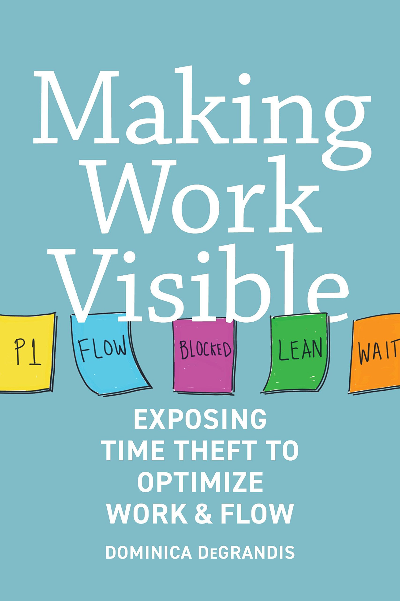
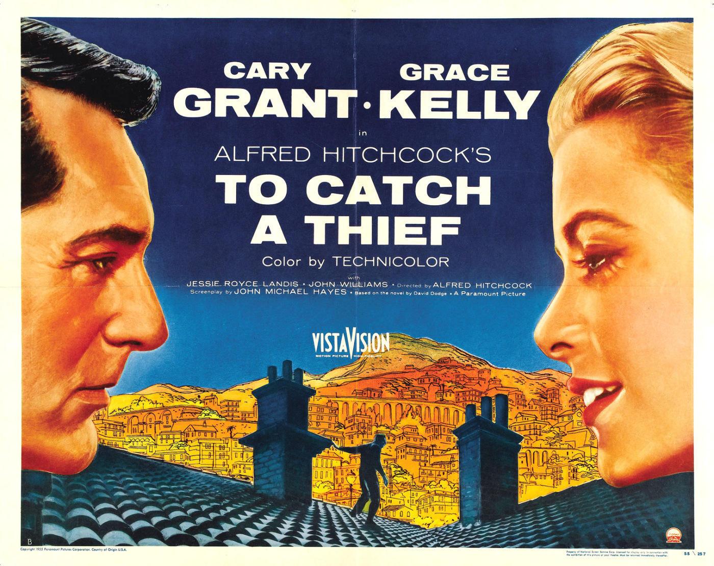
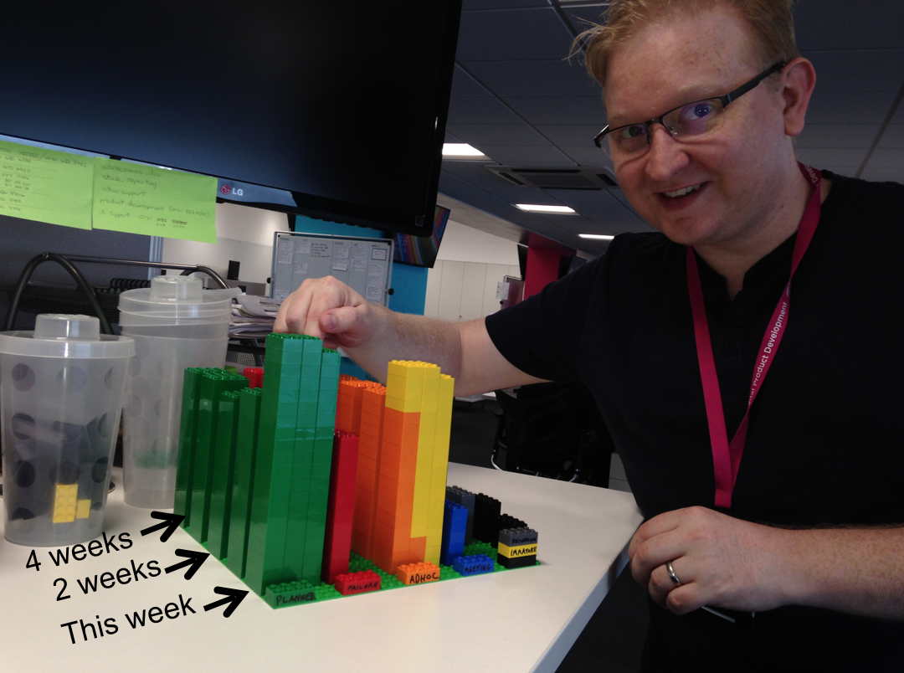
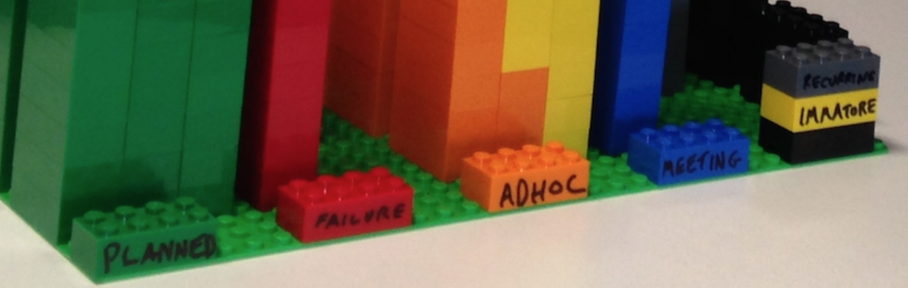
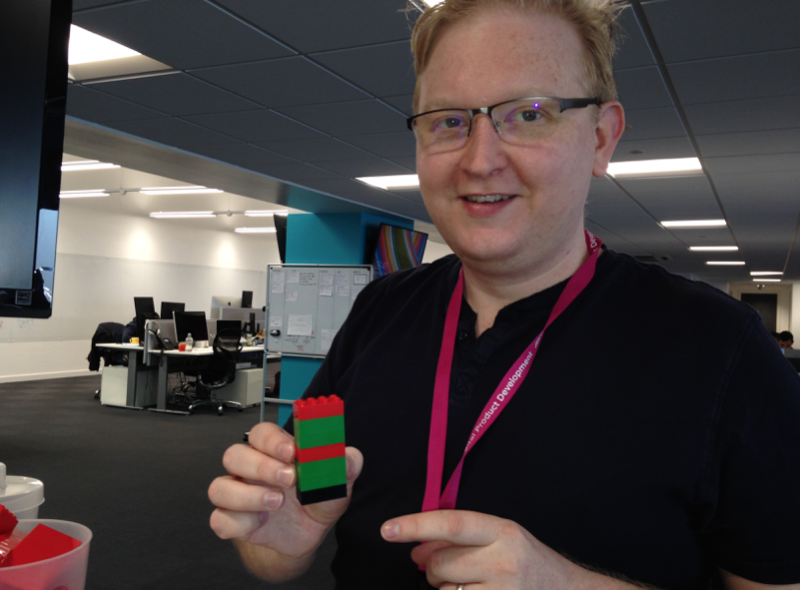
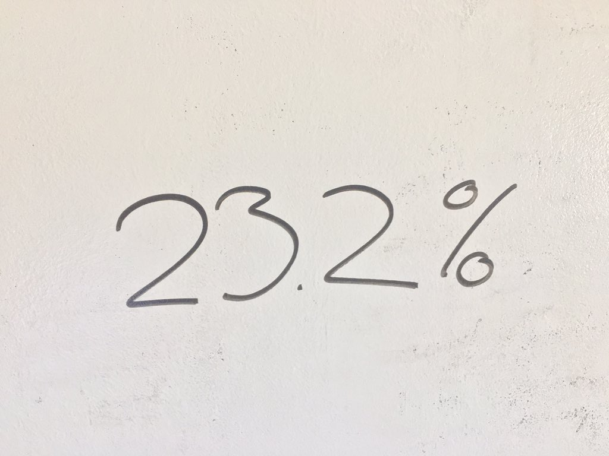
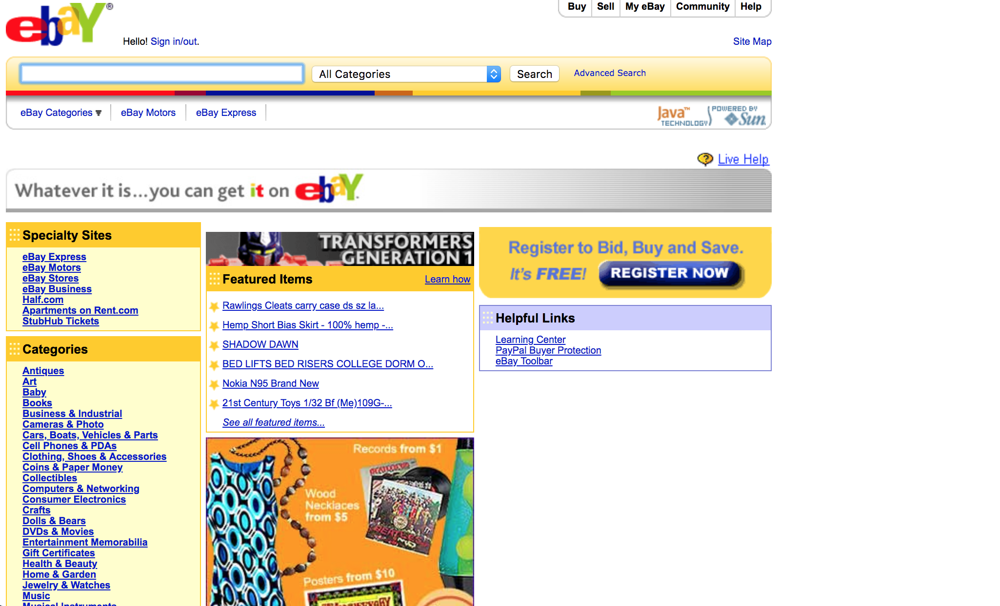

## Time bandits: don't let these vampires get you

### *Joe Wright*
#### __@joe_jag__

---

## Making Work Visible - Dominica DeGrandis

---

> Busyness is an addiction, which doesn't equate to growth or value. It usually means doing a bunch of things that all turn out crappy
--Dominica DeGrandis

---

# The Five Bandits

---

# Too Much WIP

---

# Unknown Deps

---

# Unplanned Work

---

# Conflicting Priorities

> Focus is a matter of deciding what things you're not going to do 
--John Carmack

---

# Neglected Work

(Spanish Inquisition)

---

---

# Lego Workstream Visualization

---

---

---

---

---

---

# Statistics - 2016

|            | *Planned* | *Failure* | *Ad-hoc* | *Meetings* |
| ---        | ---     | ---     | ---    | ---      |
| __April__  | 23%     | 30%     | 40%    | 2%       |

---

# Statistics - 2016

|                | *Planned* | *Failure* | *Ad-hoc* | *Meetings* |
| ---            | ---     | ---     | ---    | ---      |
| __April__      | 23%     | 30%     | 40%    | 2%       |
| __November__   | 56%     | 4%      | 24%    | 10%      |

---

# eBay

---

# What are your questions?

### __@joe_jag__ - *Joe Wright*
#### https://github.com/joejag/timebandits
