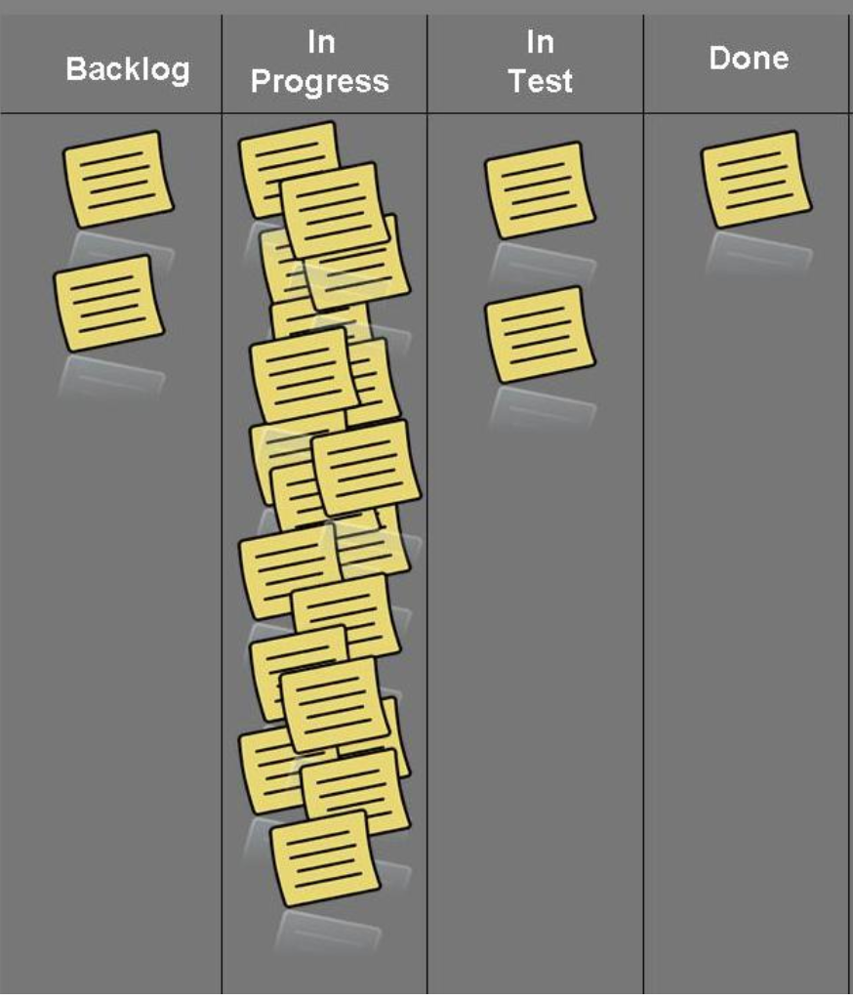
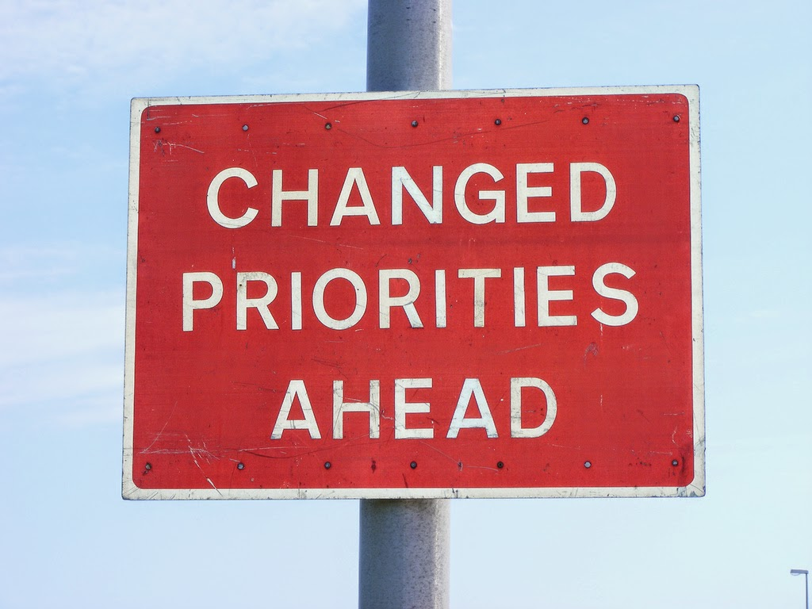

## Time bandits: don't let these vampires get you

### *Joe Wright*
#### __@joe_jag__

---

## Home of the time bandits

---

> Busyness is an addiction, which doesn't equate to growth or value. It usually means doing a bunch of things that all turn out crappy
--Dominica DeGrandis

---

# Too Much __Work in Progress__ (__WIP__)

---

# __WIP__ Clues

* Quality is suffering
* Time to get things done is going up
* We say 'yes' to every request
* Context switching

---

# [fit] __Unknown Dependencies__

---

# __Unknown Dependencies__ Clues

* High coordination costs
* Experts aren't available
* Changes to code or a plan causes unexpected things to happen

---

# __Unplanned Work__

---

# __Unplanned Work__ clues

* Planned work doesn't get done - but you did other requests
* Work skips the planning stage

---

# __Conflicting Priorities__

---

# __Conflicting Priorities__ clues

  *"When will my thing be done?"*
  *"My thing is high priority!"*
  *"If my thing doesn't get done by X, then Y"*

---

# __Neglected Work__

---

# __Neglected Work__ clues

* Delayed tasks become emergencies
* Work items in progress for over  60 days

---

---

> The aim of Kanban is to make troubles come to the surface
-- Taiichi Ohno

---

# Flow Metrics

---

# More 'No', Less WIP
(Kanban board with limits) 

---

# Expose Dependencies
 
---

# Unplanned Work
 
---

# Prioritize, Prioritize, Prioritize
 
---

# Preventing Negligence
 
---

# Lego Workstream Visualization

---

---

---

---

---

# The ask
(boardroom folk)

---

---

# Statistics - 2016

|            | *Planned* | *Failure* | *Ad-hoc* | *Meetings* |
| ---        | ---     | ---     | ---    | ---      |
| __April__  | 23%     | 30%     | 40%    | 2%       |

---

# Statistics - 2016

|                | *Planned* | *Failure* | *Ad-hoc* | *Meetings* |
| ---            | ---     | ---     | ---    | ---      |
| __April__      | 23%     | 30%     | 40%    | 2%       |
| __November__   | 56%     | 4%      | 24%    | 10%      |

---

# eBay

---

# What are your questions?

### __@joe_jag__ - *Joe Wright*
#### https://github.com/joejag/timebandits
