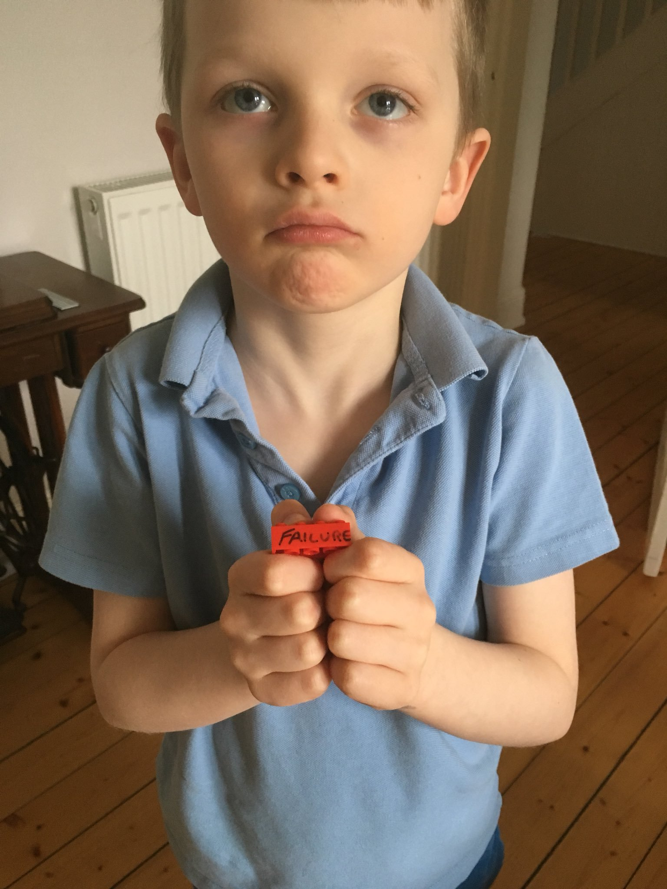

## Lego Workstream Visualisation

### *Joe Wright*
#### __@joe_jag__

---

---

---

---

---

# The ask

---

---

# Statistics - 2016

|            | *Planned* | *Failure* | *Ad-hoc* | *Meetings* |
| ---        | ---     | ---     | ---    | ---      |
| __April__  | 23%     | 30%     | 40%    | 2%       |

---

# Statistics - 2016

|                | *Planned* | *Failure* | *Ad-hoc* | *Meetings* |
| ---            | ---     | ---     | ---    | ---      |
| __April__      | 23%     | 30%     | 40%    | 2%       |
| __Nov__        | 56%     | 4%      | 24%    | 10%      |

---

---

# What are your questions?

### __@joe_jag__ - *Joe Wright*
#### https://github.com/joejag/timebandits
